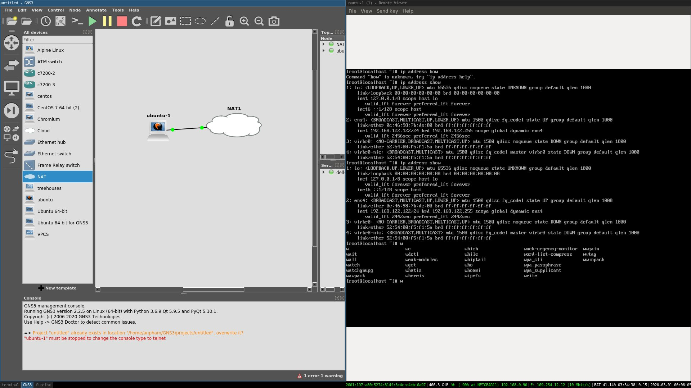

# Connect KVM VM to GNS3 

## Install GNS3
- Download the latest gns3 application 
- Add current user to kvm group. This is the most important task. Without this step, your gns3 can run kvm VM.
```
sudo usermod -aG kvm $(whoami)
```

## Locate and Verify your Disk Images.
- Find paths of your images.
- Make sure you provide full permissions to other group.

```
anpham@dell-laptop:/var/lib/libvirt/images$ ls -la                                                                                               
total 45735200                                                                                                                                   
drwxr-xr-x 2 root         root         4096 Feb 29 16:56 .                                                                                       
drwxr-xr-x 7 root         root         4096 Feb 29 23:35 ..
-rw-r--r-- 1 root         root       196640 Feb 29 16:56 disk1.img
-rw------- 1 libvirt-qemu kvm   21478375424 Feb  5 04:14 generic.qcow2
-rw------- 1 libvirt-qemu kvm  107390828544 Feb 26 04:43 ubuntu18.04.qcow2
-rwxrwxrwx 1 root         root  72232271872 Feb 29 22:57 ubuntu-virt
-rw------- 1 libvirt-qemu kvm  107390828544 Feb 27 14:50 win10.qcow2
```

As you can see, I have ubuntu-virt images full permissions, so this will assure my VM running over GNS3.
 
**Note**: After connecting with NAT, you may need to issue `dhcpclient` command so that your interface can new ip address. For example, `dhcpclient ens4` will give and ip for my interface.

# Expected Result 


# FAQ:

