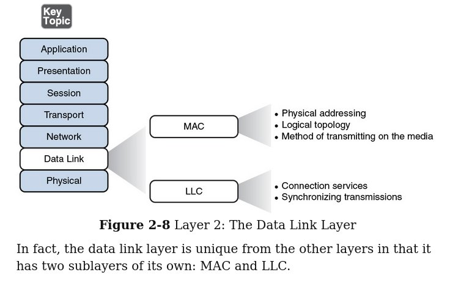

# Chapter 2: The OSI model reference model

# Objectives:
- Familiar with network type (PAN, WAN, LAN)
- OSI (open system interconnection model)

# Description:
- Match well-known port
- tcp/ip protocols and well-known function
- OSI model layer function
- Network applicaton layer  

# Main note
- Switches are belong to datalink layer
- There are two topology type: logical topology and physical topology 
- There are 7 layers in OSI  model:
  1. physical layer -> bits
  2. data link layer -> frames 
  3. network layer -> packets
  4. transport layer -> segment 
  5. session layer ->  
  6. presentation layer -> encryption
  7. application layer -> services associated with ports
-  
## The Physical Layer
- Define the following:
  - How bits represent in medium: 1 and 0
    - defined by voltage fluctuation 
    - defined by light reflection. 

  - Wiring standard for connectors and jacks
  - Physical topology
  - Synchronizing bits:
    - Asynchronous:  
    - Synchronous: 
  - Bandwidth usage: 
    - Broadband: analogy signal (radio and optical) used with FDM  
    - Baseband: digital signal (1 signal at the time) 
  - Multiplexing strategy (multiple channel)
    - time division (tdm) divide time into slots (users).  
    - statistical ()analysis priority of data, user with the most data will be given the most time slot.  
    - FDM combine frequency over a channel 
- At this layers, "Hub" devices are designed to work well with this layer.

## The Data Link Layer
- Packaging data into frames and transmitting those frames on the network
- Performing error detection/correction
- Uniquely finding network devices with an address
- Handling flow control
In short all of these processes is known as data link control (DLC). Additionally, data link layer actually have two sublayers which are MAC and LLC.  

### MAC physical address 
- A type of address that vendor used to identify the hardware.
### Logical Link Control (LLC)
Chracteristics of LLC
		- connection services: 
		- flow control: limits the amount of data a sender can send at one time; this prevents the sender from overwheliming the receiver with too much information.
		- error control: Allows the recipient of data to let the sender know whether the expected data frame was not received or whether it was received but is corrupted. By checking the checksum, it lets the receipt know if the data is corrupted. If it is corrupted, receipient will notify the sender.
		

